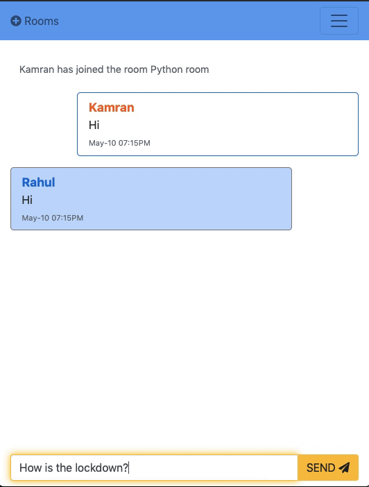

# Chat App Using Flask-SocketIO & Deployed on Heroku

## Introduction
This is a chat application, implemented using Flask-SocketIO with both the database (PostgreSQL) and the app deployed in Heroku. It also has user registration and authentication 
Functionalities .

## Demo


## Files in the program
- **app.py**: This is the main app file and contains both the registration/login page logic and the Flask-SocketIO backend for the app.
- **models.py**: Contains Flask-SQLAlchemy models used for user registration and login in application.py
- **wtform_fields.py**: Contains the classes for WTForms/Flask-WTF and the custom validators for the fields
- **Procfile**: file required for Heroku
- **requirements.txt**: list of Python packages installed (also required for Heroku)
- **templates/**: folder with all HTML files
- **static/**: for with all JS scripts and CSS files

## Usage
### Run app
Use [the link to the production server](http://flask-socket-chat.herokuapp.com) directly.

### Clone/Modify app
1. Modify application.py to replace the secret key *(i.e. os.environ.get('SECRET'))* with a secret key of your choice and the database link *(i.e. os.environ.get('DATABASE_URL'))* with the link to your own database.

    The two lines to be edited in application.py are shown below:
```python
app.secret_key = os.environ.get('SECRET')
app.config['SQLALCHEMY_DATABASE_URI'] = os.environ.get('DATABASE_URL')
```
2. Clone the repo
```
git clone https://github.com/skamranahmed/socketio-chat-app.git
cd socketio-chat-app
python3 app.py
```
App will be live on http://127.0.0.1:5000/
